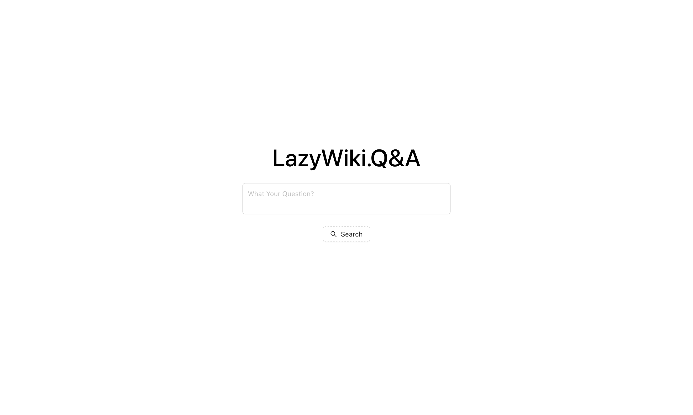

# LazyWiki.Q&A
> Note: This project was developed prior to certain OpenAI API modifications. Some sections of the project need to be updated in order to incorporate these changes.

---

Inspired by https://github.com/shbhrsaha/wikipedia-gpt3-bot

Introducing "LazyWiki.Q&A" – Unleash the Power of OpenAI GPT Chatbot with Wikipedia Integration!

Tired of endless searches for accurate information? Welcome to LazyWiki.Q&A, your ultimate solution for swift and precise answers. Harnessing the prowess of OpenAI's GPT chatbot and seamlessly integrating it with Wikipedia, LazyWiki.Q&A revolutionizes your information quest.

With LazyWiki.Q&A, complex queries turn effortless. Curious minds and students can now delve into the $$wealth of knowledge that Wikipedia holds, instantly tapping into its vast database through conversational interactions. The project marries the conversational prowess of GPT with Wikipedia's extensive information, presenting a dynamic duo that's a game-changer for research, problem-solving, and exploration.

> Just a quick note: I was pretty tired and thought it would be fun to see if ChatGPT could come up with a description for this project.

## Example of Frontend
